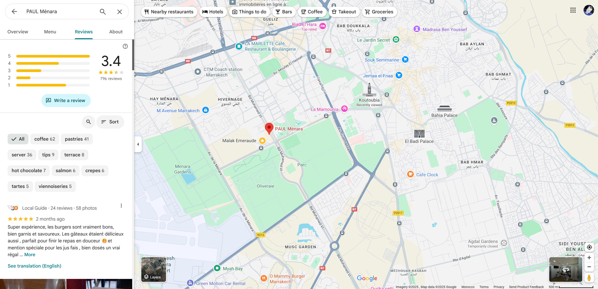
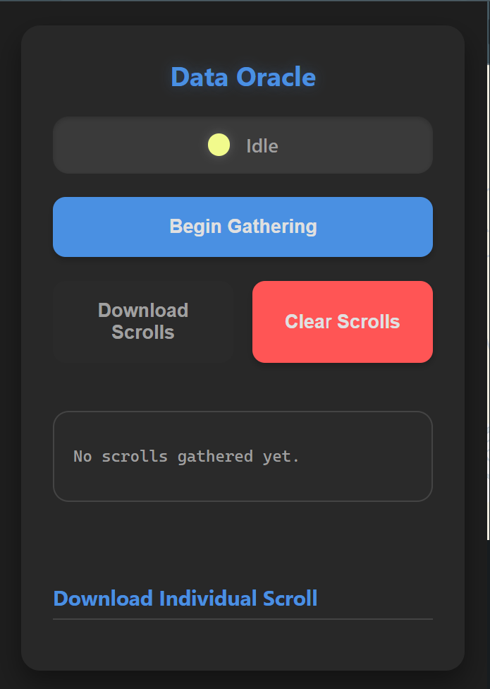
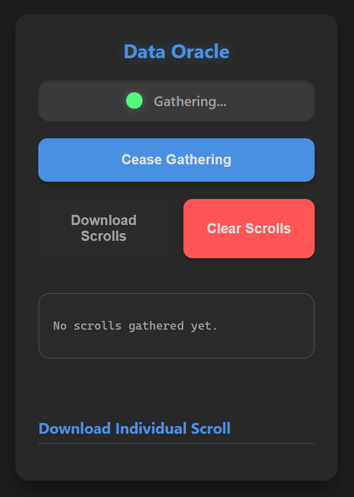

# Google Maps Review Gatherer

This Chrome extension allows you to easily gather reviews from Google Maps listings. It provides a simple interface to extract review data and save it in a structured JSON format.

## How to Install

1.  Download the repository as a ZIP file and unzip it.
2.  Open Chrome and navigate to `chrome://extensions`.
3.  Enable "Developer mode" in the top right corner.
4.  Click "Load unpacked" and select the unzipped folder.

## Workflow

1.  **Navigate to a Google Maps Listing:** Open Google Maps in your Chrome browser and go to the page of the business or location you want to gather reviews from.

    

2.  **Open the Extension:** Click on the extension's icon in your browser's toolbar.

    

3.  **Start Gathering:** Click the "Begin Gathering" button to start extracting reviews.

    

    The extension will gather the initial set of reviews visible on the page.

    

4.  **Scroll for More:** The extension is designed to automatically load more reviews as you scroll down the reviews section on the Google Maps page. This GIF demonstrates the process:

    

## Additional Features

### Highlight Reviews

The extension can also highlight the reviews it has successfully gathered directly on the Google Maps page.

1.  **Enable Highlighting:** Click the "Highlight Reviews" button in the extension popup.

    

2.  **View Highlighted Reviews:** The gathered reviews will be highlighted in green on the page.

    

## Data Structure

The gathered data is saved in a JSON file with the following structure:

```json
[
  {
    "review_text": "The review text...",
    "rating": 5,
    "user_name": "John Doe",
    "review_date": "2 weeks ago"
  },
  {
    "review_text": "Another review...",
    "rating": 4,
    "user_name": "Jane Smith",
    "review_date": "a month ago"
  }
]
```

Each object in the JSON array represents a single review and contains the following fields:

*   `review_text`: The full text of the review.
*   `rating`: The star rating given by the user (1-5).
*   `user_name`: The name of the user who wrote the review.
*   `review_date`: The date the review was posted.
